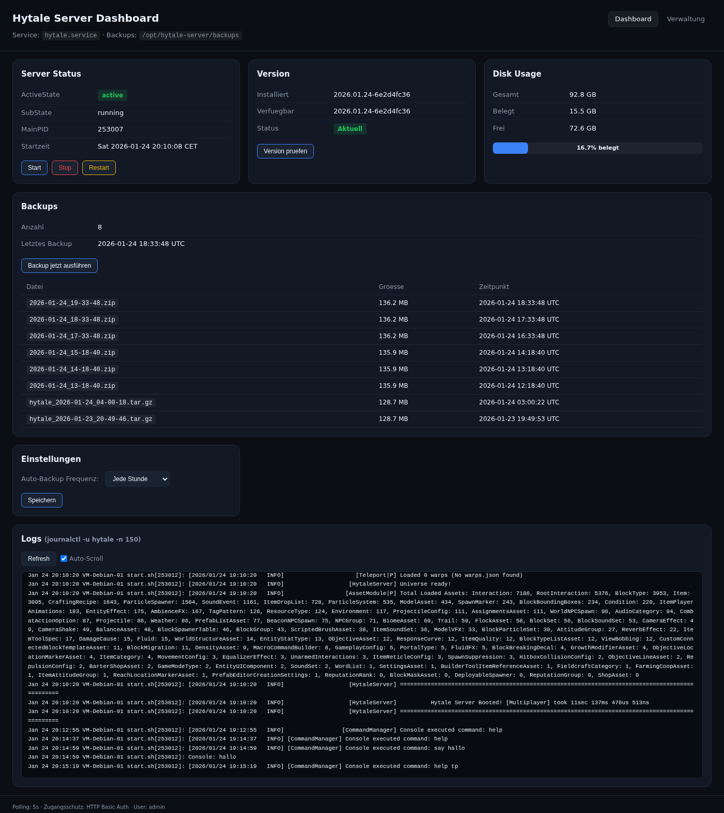
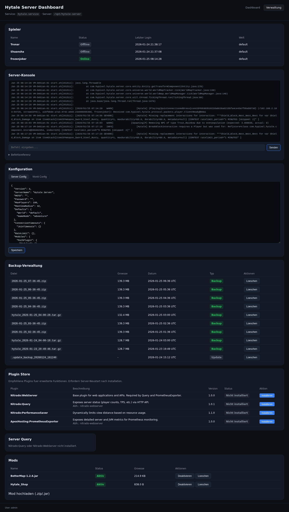

# Hytale Server Dashboard

Web-Dashboard zur Verwaltung eines Hytale Dedicated Servers unter Linux (Debian/Ubuntu).

## Screenshots

### Dashboard (Hauptseite)


### Verwaltung (Management-Seite)


---

## Features

### Dashboard (Hauptseite `/`)
- **Service-Status**: ActiveState, SubState, MainPID, Uptime
- **Disk-Auslastung**: Belegung der Server-Partition mit visueller Anzeige
- **Version**: Aktuelle und verfuegbare Server-Version, manuelles/automatisches Update
- **Backup-Uebersicht**: Liste der vorhandenen Backups mit Groesse und Datum
- **Logs**: Live-Tail der letzten 150 Zeilen (Auto-Polling)
- **Server-Steuerung**: Start/Stop/Restart Buttons, Backup ausloesen

### Verwaltung (Zweite Seite `/manage`)
- **Spieler-Liste**: Online/Offline-Status, Letzter Login, aktuelle Welt
- **Server-Konsole**: Befehle direkt an den Server senden (via FIFO Pipe)
- **Konfiguration**: Server Config und World Config live editieren (JSON)
- **Backup-Verwaltung**: Backups anzeigen, loeschen
- **Mod-Verwaltung**: Mods auflisten, aktivieren/deaktivieren, loeschen, hochladen (.zip)

### Allgemein
- Dark-Theme UI
- HTTP Basic Authentication
- Responsive Design
- Toast-Benachrichtigungen

---

## Voraussetzungen

- Debian 12+ / Ubuntu 22.04+
- Python 3.11+
- systemd
- Hytale Dedicated Server Binary (von Hypixel)

---

## Hytale Server Installation

### 1. System-User anlegen

```bash
sudo useradd -r -m -d /opt/hytale-server -s /bin/bash hytale
```

### 2. Server-Dateien herunterladen

Den Hytale Downloader von der offiziellen Quelle beziehen und unter `/opt/hytale-server/.downloader/` ablegen:

```bash
sudo mkdir -p /opt/hytale-server/.downloader
sudo chown -R hytale:hytale /opt/hytale-server

# Als hytale-User einloggen
sudo -u hytale bash
cd /opt/hytale-server

# Downloader ausfuehren (erfordert einmalige OAuth-Authentifizierung)
.downloader/hytale-downloader-linux-amd64 \
  -download-path .downloader/game.zip \
  -credentials-path .downloader/.hytale-downloader-credentials.json
```

Beim ersten Start oeffnet sich ein OAuth-Flow im Browser. Nach der Authentifizierung werden die Credentials gespeichert.

### 3. Server entpacken

```bash
cd /opt/hytale-server
unzip .downloader/game.zip
```

Die Verzeichnisstruktur sollte so aussehen:

```
/opt/hytale-server/
├── Server/
│   └── HytaleServer.jar
├── Assets.zip
├── config.json
├── universe/
│   └── worlds/
│       └── default/
│           └── config.json
├── mods/
├── backups/
├── start.sh              (Wrapper-Script)
└── .downloader/
    ├── hytale-downloader-linux-amd64
    ├── game.zip
    └── .hytale-downloader-credentials.json
```

### 4. Wrapper-Script installieren

Das Wrapper-Script ermoeglicht die Konsolen-Eingabe ueber eine FIFO Pipe:

```bash
sudo cp /opt/hytale-dashboard/start-hytale.sh /opt/hytale-server/start.sh
sudo chmod 755 /opt/hytale-server/start.sh
sudo chown hytale:hytale /opt/hytale-server/start.sh
```

### 5. Systemd-Service einrichten

```bash
sudo cp /opt/hytale-dashboard/hytale.service /etc/systemd/system/hytale.service
sudo systemctl daemon-reload
sudo systemctl enable hytale.service
sudo systemctl start hytale.service
```

### 6. Server-Parameter anpassen (optional)

```bash
sudo systemctl edit hytale.service
```

```ini
[Service]
ExecStart=
ExecStart=/opt/hytale-server/start.sh -Xms2G -Xmx4G -jar Server/HytaleServer.jar --assets Assets.zip --bind 0.0.0.0:5520 --backup --backup-frequency 60 --backup-dir backups
```

Wichtige Flags:
- `-Xms2G -Xmx4G`: Java Heap (min/max)
- `--bind 0.0.0.0:5520`: IP und Port
- `--backup`: Automatische Backups aktivieren
- `--backup-frequency 60`: Backup-Intervall in Minuten
- `--backup-dir backups`: Backup-Verzeichnis

### 7. Server-Konfiguration (`config.json`)

Die Hauptkonfiguration des Servers liegt in `/opt/hytale-server/config.json`:

```json
{
  "Version": 3,
  "ServerName": "Hytale Server",
  "MOTD": "",
  "Password": "",
  "MaxPlayers": 100,
  "MaxViewRadius": 32,
  "Defaults": {
    "World": "default",
    "GameMode": "Adventure"
  },
  "PlayerStorage": {
    "Type": "Hytale"
  },
  "AuthCredentialStore": {
    "Type": "Encrypted",
    "Path": "auth.enc"
  }
}
```

Wichtige Einstellungen:
- `ServerName`: Name des Servers (wird Spielern angezeigt)
- `Password`: Server-Passwort (leer = kein Passwort)
- `MaxPlayers`: Maximale Spieleranzahl
- `MaxViewRadius`: Sichtweite in Chunks
- `Defaults.GameMode`: Standard-Spielmodus (`Adventure`, `Creative`, etc.)

### 8. Authentifizierung und Credentials (`auth.enc`)

Der Hytale-Server speichert Authentifizierungs-Credentials verschluesselt in der Datei `auth.enc`. Diese wird automatisch erstellt und verwaltet.

```
/opt/hytale-server/auth.enc       (verschluesselte Auth-Daten)
```

**Wichtig:**
- Die Datei `auth.enc` wird beim ersten Start oder Login automatisch erstellt
- Sie enthaelt die verschluesselten OAuth-Credentials fuer den Server
- Bei der Erstinstallation muss einmalig eine Authentifizierung ueber den Browser erfolgen
- Die Credentials werden dann verschluesselt gespeichert und automatisch erneuert
- **Niemals `auth.enc` manuell bearbeiten oder loeschen** (sonst ist Re-Authentifizierung noetig)
- Die Datei hat restriktive Berechtigungen (`600`) und gehoert dem `hytale`-User

Das Update-Script (`hytale-update.sh`) bewahrt `auth.enc` bei Updates automatisch.

### 9. Firewall konfigurieren

```bash
sudo ufw allow 5520/udp comment "Hytale Server"
```

### Wichtige Hinweise zum Server

- **KillSignal=SIGINT**: Der Server muss mit SIGINT gestoppt werden (nicht SIGTERM), damit Spielerdaten (Inventar, Position) korrekt gespeichert werden.
- **FIFO Pipe**: Das Wrapper-Script (`start.sh`) erstellt eine Named Pipe unter `/opt/hytale-server/.console_pipe`. Ueber diese Pipe koennen Befehle an die Server-Konsole gesendet werden.
- **Mods**: Mods werden als Unterverzeichnisse in `/opt/hytale-server/mods/` abgelegt. Deaktivierte Mods haben das Suffix `.disabled`.

---

## Dashboard Installation

### 1. Dashboard-User anlegen

```bash
sudo useradd -r -s /usr/sbin/nologin hytale-web
sudo usermod -aG hytale hytale-web
sudo usermod -aG systemd-journal hytale-web
```

### 2. Projekt klonen

```bash
sudo mkdir -p /opt/hytale-dashboard
sudo chown hytale-web:hytale-web /opt/hytale-dashboard
cd /opt/hytale-dashboard
git clone https://github.com/zonfacter/hytale-dashboard.git .
```

### 3. Python Virtual Environment

```bash
sudo -u hytale-web bash -c '
cd /opt/hytale-dashboard
python3 -m venv .venv
.venv/bin/pip install -r requirements.txt
'
```

### 4. Dashboard-Service installieren

```bash
sudo cp /opt/hytale-dashboard/hytale-dashboard.service /etc/systemd/system/
sudo systemctl daemon-reload
sudo systemctl enable hytale-dashboard.service
```

### 5. Passwort aendern

```bash
sudo systemctl edit hytale-dashboard.service
```

```ini
[Service]
Environment=DASH_PASS=DEIN_SICHERES_PASSWORT
```

### 6. Sudoers-Regeln einrichten

```bash
sudo visudo -f /etc/sudoers.d/hytale-dashboard
```

Inhalt:

```
# Hytale Dashboard - Service-Steuerung
hytale-web ALL=(ALL) NOPASSWD: /bin/systemctl start hytale.service
hytale-web ALL=(ALL) NOPASSWD: /bin/systemctl stop hytale.service
hytale-web ALL=(ALL) NOPASSWD: /bin/systemctl restart hytale.service

# Update-Script
hytale-web ALL=(ALL) NOPASSWD: /usr/local/sbin/hytale-update.sh
```

### 7. Update-Script installieren

```bash
sudo cp /opt/hytale-dashboard/hytale-update.sh /usr/local/sbin/hytale-update.sh
sudo chmod 755 /usr/local/sbin/hytale-update.sh
```

### 8. Berechtigungen setzen

```bash
# FIFO Pipe und Config muessen vom Dashboard beschreibbar sein
sudo chmod g+w /opt/hytale-server/universe/worlds/default/config.json
sudo chmod g+w /opt/hytale-server/mods/
```

### 9. Dashboard starten

```bash
sudo systemctl start hytale-dashboard.service
```

### 10. Firewall

```bash
sudo ufw allow 8088/tcp comment "Hytale Dashboard"
```

---

## Konfiguration

Alle Einstellungen erfolgen ueber Environment-Variablen in der systemd Unit-Datei:

| Variable | Standard | Beschreibung |
|----------|----------|--------------|
| `PORT` | `8088` | Dashboard-Port |
| `BIND` | `0.0.0.0` | Bind-Adresse |
| `HYTALE_SERVICE` | `hytale` | Name des Server-Services |
| `HYTALE_DIR` | `/opt/hytale-server` | Server-Verzeichnis |
| `BACKUP_DIR` | `/opt/hytale-server/backups` | Backup-Verzeichnis |
| `DASH_USER` | `admin` | Basic Auth Benutzername |
| `DASH_PASS` | `change-me` | Basic Auth Passwort |
| `ALLOW_CONTROL` | `true` | Steuerfunktionen aktivieren |

---

## Architektur

```
/opt/hytale-dashboard/
├── app.py                      # FastAPI Backend (alle API-Endpunkte)
├── requirements.txt            # Python-Abhaengigkeiten
├── hytale-dashboard.service    # systemd Unit (Dashboard)
├── hytale.service              # systemd Unit (Server, Vorlage)
├── hytale-update.sh            # Update-Script (Version pruefen + installieren)
├── start-hytale.sh             # Server-Wrapper (FIFO Pipe fuer Konsole)
├── templates/
│   ├── index.html              # Dashboard-Seite
│   └── manage.html             # Verwaltungs-Seite
└── static/
    ├── app.js                  # Dashboard JS (Status, Logs, Version, Updates)
    ├── manage.js               # Verwaltung JS (Spieler, Konsole, Config, Mods)
    └── style.css               # Dark-Theme Styling
```

---

## API-Endpunkte

### Dashboard

| Methode | Pfad | Beschreibung |
|---------|------|--------------|
| GET | `/` | Dashboard UI |
| GET | `/api/status` | Service-Status, Backups, Disk, Version |
| GET | `/api/logs` | Journal-Logs (150 Zeilen) |
| POST | `/api/server/{start\|stop\|restart}` | Service steuern |
| POST | `/api/backup/run` | Backup ausloesen |
| GET | `/api/version` | Version-Info |
| POST | `/api/version/check` | Neue Version pruefen |
| POST | `/api/update/run` | Update durchfuehren |
| POST | `/api/update/auto` | Auto-Update Toggle |
| GET | `/api/update/log` | Update-Log |

### Verwaltung

| Methode | Pfad | Beschreibung |
|---------|------|--------------|
| GET | `/manage` | Verwaltungs-UI |
| GET | `/api/players` | Spieler-Liste |
| POST | `/api/console/send` | Befehl an Server senden |
| GET | `/api/console/output` | Konsolen-Ausgabe (Journal) |
| GET | `/api/config/server` | Server-Config lesen |
| POST | `/api/config/server` | Server-Config schreiben |
| GET | `/api/config/world` | World-Config lesen |
| POST | `/api/config/world` | World-Config schreiben |
| GET | `/api/backups/list` | Backup-Liste |
| DELETE | `/api/backups/{name}` | Backup loeschen |
| GET | `/api/mods` | Mod-Liste |
| POST | `/api/mods/{name}/toggle` | Mod aktivieren/deaktivieren |
| DELETE | `/api/mods/{name}` | Mod loeschen |
| POST | `/api/mods/upload` | Mod hochladen (.zip/.jar) |
| GET | `/api/plugins` | Plugin Store (verfuegbare Plugins) |
| POST | `/api/plugins/{id}/install` | Plugin installieren |
| GET | `/api/server/query` | Server-Status via Nitrado Query |

---

## Plugin Store

Das Dashboard enthaelt einen integrierten Plugin Store mit empfohlenen Plugins:

| Plugin | Beschreibung | Autor |
|--------|--------------|-------|
| **Nitrado:WebServer** | Base plugin fuer Web-APIs. Voraussetzung fuer Query und PrometheusExporter. | [Nitrado](https://github.com/nitrado/hytale-plugin-webserver) |
| **Nitrado:Query** | Stellt Server-Status (Spieleranzahl, TPS, etc.) via HTTP API bereit. | [Nitrado](https://github.com/nitrado/hytale-plugin-query) |
| **Nitrado:PerformanceSaver** | Passt Sichtweite dynamisch an Ressourcenverbrauch an. | [Nitrado](https://github.com/nitrado/hytale-plugin-performance-saver) |
| **ApexHosting:PrometheusExporter** | Exportiert Server- und JVM-Metriken fuer Prometheus Monitoring. | [ApexHosting](https://github.com/apexhosting/hytale-plugin-prometheus) |

### Installation via Dashboard

1. Oeffne die Verwaltungsseite (`/manage`)
2. Scrolle zum "Plugin Store" Bereich
3. Klicke "Installieren" beim gewuenschten Plugin
4. Nach der Installation: **Server neu starten**

### Abhaengigkeiten

- `Nitrado:Query` und `ApexHosting:PrometheusExporter` benoetigen `Nitrado:WebServer`
- Installiere zuerst `WebServer`, dann die abhaengigen Plugins

### WebServer Konfiguration

Nach Installation von `Nitrado:WebServer` wird ein HTTPS-Server auf Port 5523 (Spielport +3) gestartet.

Konfiguration anpassen unter `mods/Nitrado_WebServer/config.json`:

```json
{
  "port": 5523,
  "tls": true
}
```

### Query API Nutzung

Wenn `Nitrado:Query` installiert ist, zeigt das Dashboard automatisch Live-Daten:
- Aktuelle Spieleranzahl
- Maximale Spieleranzahl
- Server TPS (Ticks per Second)

Die API ist erreichbar unter: `https://SERVER:5523/Nitrado/Query`

---

## Server-Konsole

Die Konsole funktioniert ueber eine FIFO Named Pipe:

1. `start.sh` erstellt `/opt/hytale-server/.console_pipe`
2. `tail -f` haelt die Pipe offen
3. Java liest stdin von der Pipe
4. Das Dashboard schreibt Befehle in die Pipe

Verfuegbare Befehle (Auswahl):

| Befehl | Beschreibung |
|--------|-------------|
| `help` | Befehlsliste anzeigen |
| `save` | Welt speichern |
| `stop` | Server stoppen |
| `time set <value>` | Tageszeit setzen |
| `whitelist add <name>` | Spieler zur Whitelist hinzufuegen |
| `say <message>` | Nachricht an alle Spieler |
| `gamemode <mode> <player>` | Spielmodus aendern |
| `tp <player> <x> <y> <z>` | Spieler teleportieren |
| `kick <player>` | Spieler kicken |

Hinweis: Befehlsausgaben (z.B. von `help`) werden auf der Server-Konsole angezeigt, nicht im Journal. Aktions-Befehle (save, stop, kick) erzeugen sichtbare Log-Eintraege.

---

## Update-System

Das Update-Script (`hytale-update.sh`) unterstuetzt zwei Modi:

### Version pruefen

```bash
sudo /usr/local/sbin/hytale-update.sh check
```

Nutzt `hytale-downloader -print-version` fuer schnelle Abfrage ohne Download.

### Update durchfuehren

```bash
sudo /usr/local/sbin/hytale-update.sh update
```

Ablauf:
1. Neue Version herunterladen
2. Server stoppen
3. Backup erstellen (`.update_backup_*`)
4. Alte Dateien ersetzen (preserviert: mods, universe, config, logs, credentials)
5. Server starten

### Auto-Update

Kann im Dashboard aktiviert werden. Fuehrt das Update automatisch nach dem naechsten Backup durch.

---

## Troubleshooting

```bash
# Dashboard-Logs
journalctl -u hytale-dashboard --no-pager -n 50

# Server-Logs
journalctl -u hytale --no-pager -n 100

# Dashboard manuell starten (Debug)
cd /opt/hytale-dashboard
source .venv/bin/activate
HYTALE_DIR=/opt/hytale-server DASH_USER=admin DASH_PASS=test ALLOW_CONTROL=true \
  uvicorn app:app --host 0.0.0.0 --port 8088

# FIFO Pipe testen
echo "help" > /opt/hytale-server/.console_pipe

# Port pruefen
ss -tlnp | grep 8088

# Berechtigungen pruefen
id hytale-web
ls -la /opt/hytale-server/.console_pipe
```

---

## Security

1. **Passwort sofort aendern!** Der Standard `change-me` ist unsicher.
2. **HTTPS empfohlen**: Reverse-Proxy (nginx/caddy) mit TLS vorschalten.
3. **Firewall**: Port 8088 nur fuer vertrauenswuerdige IPs freigeben:
   ```bash
   sudo ufw delete allow 8088/tcp
   sudo ufw allow from 192.168.1.0/24 to any port 8088 proto tcp
   ```
4. **User-Isolation**: Dashboard laeuft als eigener User (`hytale-web`), nicht als root oder `hytale`.
5. **Minimale Sudo-Rechte**: Nur die benoetigten systemctl-Befehle und das Update-Script.

---

## Credits

Dieses Projekt wurde vollstaendig von **Claude Opus 4.5** (Anthropic) entwickelt und programmiert.

**[zonfacter](https://github.com/zonfacter)** hat das Projekt konzipiert, die Anforderungen definiert und Claude bei der Entwicklung angeleitet.

Der gesamte Code - Backend (FastAPI/Python), Frontend (HTML/CSS/JavaScript), Systemd-Services, Update-Scripts und Dokumentation - wurde von der KI generiert.

---

## Lizenz

MIT
